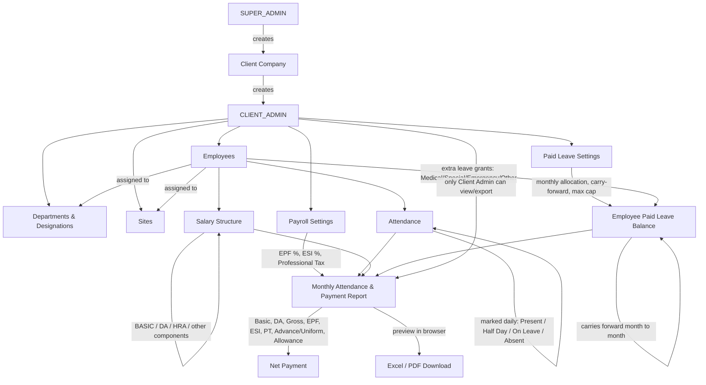
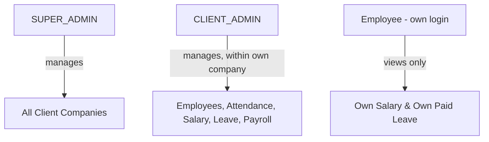

# Workforce Auth — System Flow

A visual map of how the modules connect. For setup/build instructions, see `README.md`.

## End-to-end flow

## Where each thing is configured

```mermaid
flowchart LR
    subgraph Setup [One-time / occasional setup]
        S1[Departments & Designations]
        S2[Sites]
        S3[Salary Structures & Components]
        S4[Paid Leave Settings]
        S5[Payroll Settings - EPF/ESI/PT]
    end

    subgraph Daily [Day to day]
        D1[Add / manage Employees]
        D2[Mark Attendance]
        D3[Grant Extra Paid Leave]
    end

    subgraph Monthly [Once a month]
        M1[Open Monthly Attendance & Payment Report]
        M2[Adjust Paid Leave / Advance-Uniform / Allowance if needed]
        M3[Download Excel or PDF]
    end

    Setup --> Daily --> Monthly
```

## Who can do what (simplified)

